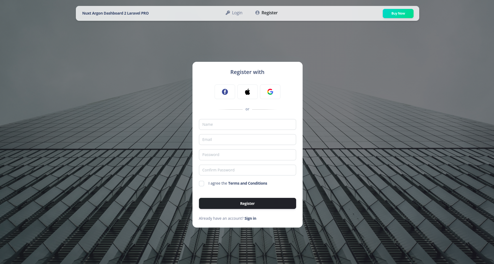
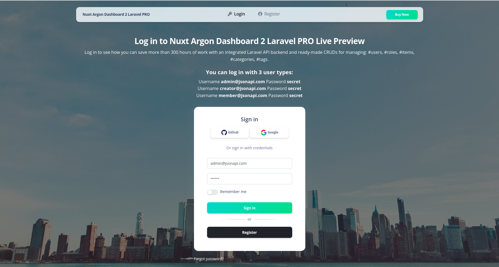
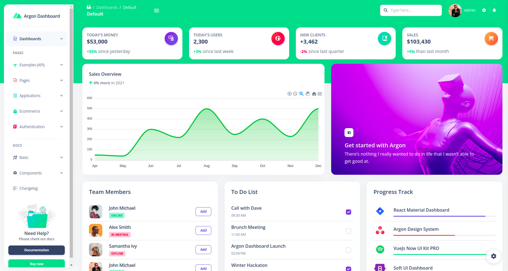
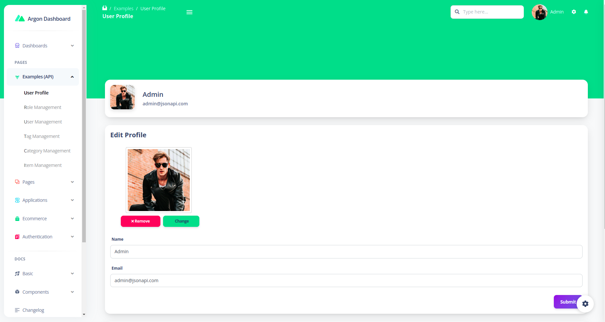
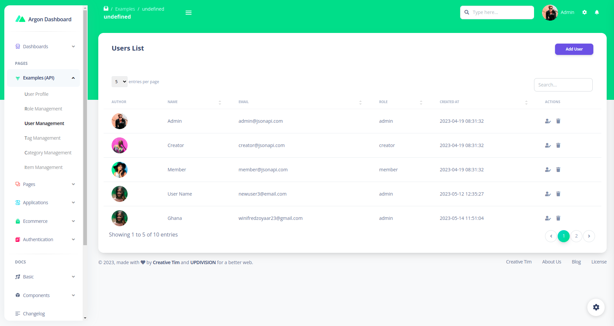
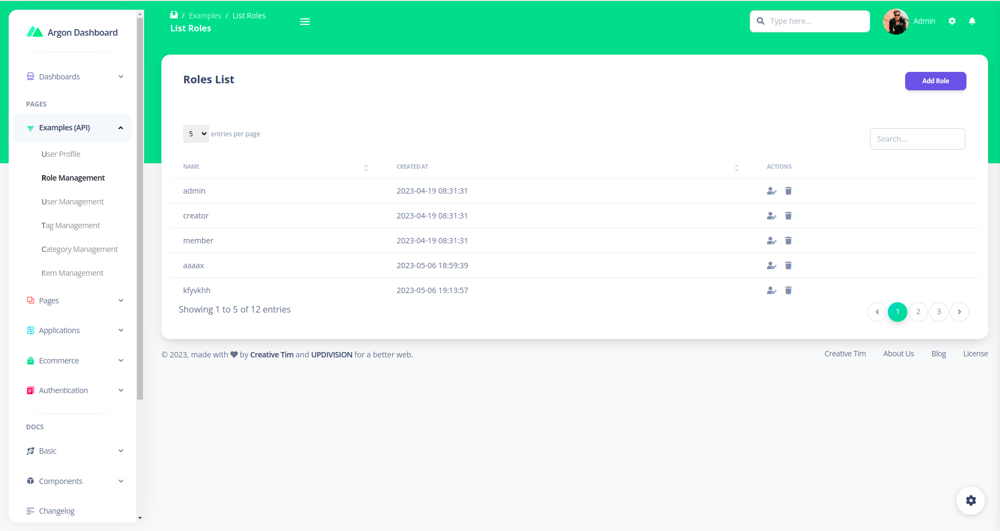
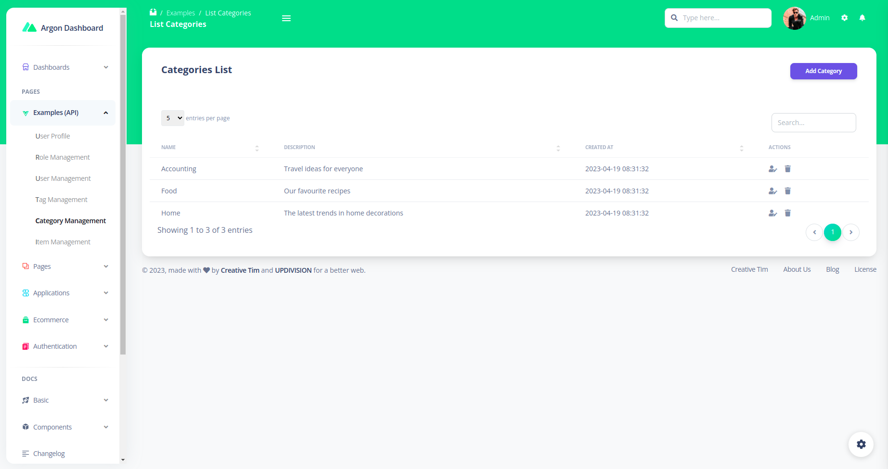
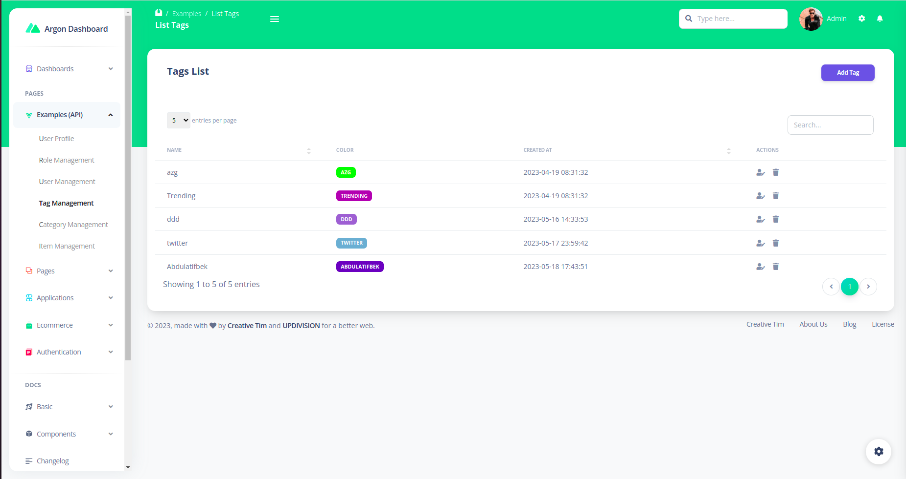
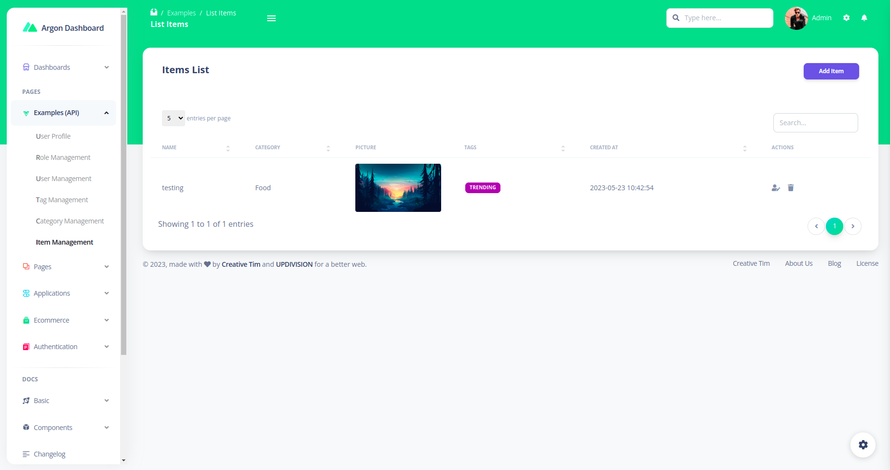

# [Nuxt Argon Dashboard 2 Laravel PRO](https://www.creative-tim.com/product/nuxt-argon-dashboard-pro-laravel/?ref=readme-nadp) [](https://twitter.com/intent/tweet?url=https://www.creative-tim.com/product/nuxt-argon-dashboard-pro-laravel&text=Check%20Nuxt%Argon%20Dashboard%202%20Pro%20made%20by%20@CreativeTim%20#webdesign%20#dashboard%20#argondesign%20#vue%20https://www.creative-tim.com/product/nuxt-argon-dashboard-pro-laravel)

 [](https://github.com/creativetimofficial/ct-nuxt-argon-dashboard-pro-laravel/issues?q=is%3Aopen+is%3Aissue) [](https://github.com/creativetimofficial/ct-nuxt-argon-dashboard-pro-laravel/issues?q=is%3Aissue+is%3Aclosed)


Start your Development with an Innovative Admin Template for Bootstrap 5 and Nuxt 3. If you like the look & feel of the hottest design trend right now, you will fall in love with this dashboard! It features a huge number of components built to fit together and look amazing.

**Fully Coded Components**<br />
Nuxt Argon Dashboard 2 PRO is built with over 200 frontend individual elements, like buttons, inputs, navbars, nav tabs, cards, or alerts, giving you the freedom of choosing and combining. All components can take variations in color, which you can easily modify using SASS files and classes. You will save a lot of time going from prototyping to full-functional code because all elements are implemented.

This Premium Bootstrap 5 & Nuxt 3 Dashboard is coming with prebuilt design blocks, so the development process is seamless,
switching from our pages to the real website is very easy to be done.

View [all components here](https://www.creative-tim.com/learning-lab/nuxt/alerts/argon-dashboard/).

**Documentation built by Developers**<br />
Each element is well presented in very complex documentation.
You can read more about the [documentation here](https://www.creative-tim.com/learning-lab/nuxt/overview/argon-dashboard/).

**Example Pages**<br />
If you want to get inspiration or just show something directly to your clients, you can jump-start your development with our pre-built example pages. Every page is spaced well, with attractive layouts and pleasing shapes. From specially designed dashboards for smart homes, virtual reality, and automotives to CRM admins, Nuxt Argon Dashboard 2 PRO has everything you need to quickly set up an amazing project.

View [example pages here](https://nuxt-argon-dashboard-pro-laravel.creative-tim.com).

**HELPFUL LINKS**

- View [Github Repository](https://github.com/creativetimofficial/ct-nuxt-argon-dashboard-pro-laravel)
- Check [FAQ Page](https://www.creative-tim.com/faq)

#### Special thanks

During the development of this dashboard, we have used many existing resources from awesome developers. We want to thank them for providing their tools open source:

- [Popper.js](https://popper.js.org/) - Kickass library used to manage poppers
- [Flatpickr](https://flatpickr.js.org/) - Useful library used to select date
- [Choices JS](https://joshuajohnson.co.uk/Choices/) - A nice plugin that select elements with intuitive multiselection and searching but also for managing tags.
- [Charts Js](https://www.chartjs.org/) - Simple yet flexible JavaScript charting for designers & developers
- [FullCalendar](https://fullcalendar.io/) - Full-sized drag & drop event calendar
- [Dropzone](https://www.dropzonejs.com/) - An open source library that provides drag’n’drop file uploads with image previews.
- [Datatables](https://github.com/fiduswriter/Simple-DataTables) - DataTables but in Vanilla ES2018 JS
- [PhotoSwipe](https://photoswipe.com/) - JavaScript image gallery for mobile and desktop, modular, framework independent
- [Quill](https://quilljs.com/) - A free, open source WYSIWYG editor built for the modern web
- [Sweet Alerts](https://sweetalert2.github.io/) - A beautiful, responsive, customisable, accessible replacement for Javascript’s popup boxes.
- [Wizard](https://www.cssscript.com/multi-step-form-bootstrap/) - Animated Multi-step form for Bootstrap

Let us know your thoughts below. And good luck with development!

## Table of Contents

- [Quick Start](#quick-start)
- [Prerequisites](#prerequisites)
- [Documentation](#documentation)
- [Versions](#versions)
- [Demo](#demo)
- [File Structure](#file-structure)
- [Browser Support](#browser-support)
- [Resources](#resources)
- [Reporting Issues](#reporting-issues)
- [Technical Support or Questions](#technical-support-or-questions)
- [Licensing](#licensing)
- [Useful Links](#useful-links)

## Quick start

Quick start options:

- Buy from [Creative Tim](https://www.creative-tim.com/product/nuxt-argon-dashboard-pro-laravel?ref=readme-nadp).

## Prerequisites

The Laravel JSON:API backend project requires a working Apache/Nginx local environment with PHP, Composer and MySQL.

The Laravel JSON:API frontend project requires a working local environment with NodeJS version 8.9 or above (8.11.0+ recommended), npm, VueCLI.

If you don't already have a local development environment, use one of the following links:

- Windows: [How to install WAMP on Windows](https://updivision.com/blog/post/beginner-s-guide-to-setting-up-your-local-development-environment-on-windows)
- Linux & Mac: [How to install LAMP on Linux & Mac](https://updivision.com/blog/post/guide-what-is-lamp-and-how-to-install-it-on-ubuntu-and-macos)
- Install Composer: [https://getcomposer.org/doc/00-intro.md](https://getcomposer.org/doc/00-intro.md)

Install Composer: https://getcomposer.org/doc/00-intro.md

Install Node: https://nodejs.org/ (version 8.11.0+ recommended)

Install NPM: https://www.npmjs.com/get-npm

Install VueCLI: https://cli.vuejs.org/guide/installation.html

## Laravel JSON:API Project Installation

1. Navigate in your Laravel API project folder: `cd your-laravel-json-api-project`
2. Install project dependencies: `composer install`
3. Create a new .env file: `cp .env.example .env`
4. Add your own database credentials in the .env file in DB_DATABASE, DB_USERNAME, DB_PASSWORD
5. Create users table: `php artisan migrate --seed`
6. Generate application key: `php artisan key:generate`
7. Install Laravel Passport: php artisan passport:install and set in the .env file the CLIENT_ID and CLIENT_SECRET that you receive
8. Add your own mailtrap.io credentials in MAIL_USERNAME and MAIL_PASSWORD in the .env file

## Vue Argon Dashboard Project Installation

1. Navigate to your Vue Dashboard project folder: `cd your-vue-argon-dashbord-project`
2. Install project dependencies: `npm install`
3. Create a new .env file: `cp .env.example .env`
4. `VUE_APP_BASE_URL` should contain the URL of your Vue Argon Dashboard Project (eg. http://localhost:8080/)
5. `VUE_APP_API_BASE_URL` should contain the URL of your Laravel JSON:API Project. (eg. http://localhost:3000/api/v1)
6. Run `npm run dev` to start the application in a local development environment or `npm run build` to build release distributables.

## Documentation

The documentation for the Nuxt Argon Dashboard 2 PRO Laravel is hosted at our [website](https://www.creative-tim.com/learning-lab/nuxt/overview/argon-dashboard/?ref=readme-nadp).

## Usage
To start testing the Pro theme, register as a user or log in using one of the default users:
- admin type - admin@jsonapi.com with the password secret
- creator type - creator@jsonapi.com with the password secret
- member type - member@jsonapi.com with the password secret

In addition to the features included in the free theme, the Pro theme also has a role management example with an updated user management, as well as tag management, category management and item management examples. Keep in mind that all the features can be viewed once you log in using the credentials provided above or by registering your own user.

Each role has a different privilege level and can perform a certain number of actions according to this level.

A member type user can log in, update his profile and view a list of added items. A creator type user can log in, update his profile and perform actions on categories, tags and items. A admin type user can log in, update his profile and perform actions on categories, tags, items, roles and users.

### Login
The login functionality is fully implemented in our theme helping you to start your project in no time. To login into dashboard you just have to add /login in the URL and fill the login form with one of the credentials (user: admin@jsonapi.com, creator@jsonapi.com, member@jsonapi.com and password: secret).

The `pages\login.vue` is the Vue component which handles the login functionality. You can easily adapt it to your needs.

It uses the auth store located in `stores\AuthStore.js`.

####  Login Component
```
<form role="form" class="text-start" @submit.prevent="submitForm">
    <div class="mb-3">
        <ArgonInput name="email" id="email" type="text" placeholder="Email" aria-label="Email" v-model="formData.email"
            :error="isError('email', errorsRef)" :errorMessage="getErrorMessage('email', errorsRef)" />
    </div>
    <div class="mb-3">
        <ArgonInput name="password" id="password" type="password" placeholder="Password" aria-label="Password"
            v-model="formData.password" :error="isError('password', errorsRef)"
            :errorMessage="getErrorMessage('password', errorsRef)" />
    </div>
    <ArgonSwitch id="rememberMe" name="rememberMe">
        Remember me
    </ArgonSwitch>
    <div class="text-center">
        <ArgonButton type="submit" color="success" variant="gradient" full-width class="my-4 mb-2">Sign in</ArgonButton>
    </div>
    <div class="mb-2 position-relative text-center">
        <p class="text-sm font-weight-bold mb-2 text-secondary text-border d-inline z-index-2 bg-white px-3">
            or
        </p>
    </div>
    <div class="text-center">
        <ArgonButton color="dark" variant="gradient" full-width class="mt-2 mb-4"
            @click.prevent="router.push({ path: '/register' })">Register</ArgonButton>
    </div>
</form>
```

### Register
The register functionality is fully implemented in our theme helping you to start your project in no time. To register a new user you just have to add /signup in the URL or click on signup link from login page and fill the register form with user details.

The `pages\signup.vue` is the Vue component which handles the register functionality. You can easily extend it to your needs.

It uses the auth store located in `stores\AuthStore.js`.

#### Register Component
```
<form role="form" @submit.prevent="submitForm">
  <ArgonInput name="name" id="name" type="text" placeholder="Name" aria-label="Name" v-model="formData.name"
    :error="isError('name', errorsRef)" :errorMessage="getErrorMessage('name', errorsRef)" />
  <ArgonInput name="email" id="email" type="text" placeholder="Email" aria-label="Email" v-model="formData.email"
    :error="isError('email', errorsRef)" :errorMessage="getErrorMessage('email', errorsRef)" />
  <ArgonInput name="password" id="password" type="password" placeholder="Password" aria-label="Password"
    v-model="formData.password" :error="isError('password', errorsRef)"
    :errorMessage="getErrorMessage('password', errorsRef)" />
  <ArgonInput name="passwordConfirm" id="passwordConfirm" type="password" placeholder="Confirm Password"
    aria-label="Password" v-model="formData.passwordConfirm" :error="isError('passwordConfirm', errorsRef)"
    :errorMessage="getErrorMessage('passwordConfirm', errorsRef)" />
  <ArgonCheckbox id="terms" name="terms" v-model:checked="formData.isChecked">
    <label class="form-check-label" for="terms">
      I agree the
      <a href="javascript:;" class="text-dark font-weight-bolder">Terms and Conditions</a>
    </label>
  </ArgonCheckbox>
  <span v-if="isError('terms', errorsRef)" style="color: #fd5c70; margin-left: 5px; font-size: 12px">
    {{ getErrorMessage('terms', errorsRef) }}
  </span>
  <div class="text-center">
    <ArgonButton type="submit" full-width color="dark" variant="gradient" class="my-4 mb-2">Register
    </ArgonButton>
  </div>

  <p class="text-sm mt-3 mb-0">
    Already have an account?
    <NuxtLink to="/" class="text-dark font-weight-bolder">
      Sign in
    </NuxtLink>
  </p>
</form>
```

### User Profile
You have the option to edit the current logged in user's profile information (name, email, profile picture) and password. To access this page, just click the "Examples(API)/User Profile" link in the left sidebar or add `/examples/user-profile` in the URL.

The `pages\examples\user-profile` is the file with Vue component that handle the update of the user information and password.

#### User Profile Component
```
<div>
    <div class="card shadow-lg mx-4 p-3 mt-4">
        <h5 class="font-weight-bolder mb-0">Edit Profile</h5>
        <div class="mt-4">
            <div class="d-flex flex-column max-content align-items-center mb-4 mx-4">
                
                <div class="mt-2 d-flex justify-content-center">
                    <ArgonButton v-if="imgSrc !== defaultAvatar" type="button" @click="handleFileRemove()"
                        class="btn base-button btn btn-sm btn-danger btn-button mx-2">
                        <span><i class="fa fa-times"></i> Remove </span>
                    </ArgonButton>
                    <ArgonButton type="button" class="btn base-button btn btn-sm btn-primary btn-button">
                        <label for="imageInput" class="mb-0">{{ imgSrc !== defaultAvatar ? 'Change' : 'Select image' }}
                        </label>
                        <input ref="file" id="imageInput" accept="image/*" type="file" style="display: none;"
                            v-on:change="handleFileUpload()" />
                    </ArgonButton>
                </div>
            </div>
            <div class="col-12 mt-sm-0">
                <label>Name</label>
                <ArgonInput id="user-name" class="multisteps-form__input" type="text" placeholder="Name"
                    v-model="newName" :error="isError('name', errorsRef)"
                    :errorMessage="getErrorMessage('name', errorsRef)" />
            </div>
            <div class="col-12 mt-sm-0">
                <label>Email</label>
                <ArgonInput id="user-email" class="multisteps-form__input" type="email" placeholder="Email"
                    v-model="newEmail" :error="isError('email', errorsRef)"
                    :errorMessage="getErrorMessage('email', errorsRef)" />
            </div>
            <div class="button-row d-flex mt-4">
                <ArgonButton type="button" color="primary" variant="gradient" class="ms-auto mb-0"
                    @click.prevent="$isDemo(userId) ? $demoMessage('users') : handleSubmit()">Submit
                </ArgonButton>
            </div>
        </div>
    </div>
    <div class="card shadow-lg mx-4 p-3 mt-4">
        <h5 class="font-weight-bolder mb-0">Change Password</h5>
        <div class="mt-4">
            <div class="col-12 mt-sm-0">
                <label>New Password</label>
                <ArgonInput id="new-password" class="multisteps-form__input" type="password" placeholder="******"
                    v-model="password" :error="isError('password', passwordErrorsRef)"
                    :errorMessage="getErrorMessage('password', passwordErrorsRef)" />
            </div>
            <div class="col-12 mt-sm-0">
                <label>Repeat New Password</label>
                <ArgonInput id="repeat-password" class="multisteps-form__input" type="password" placeholder="******"
                    v-model="passwordConfirm" :error="isError('passwordConfirm', passwordErrorsRef)"
                    :errorMessage="getErrorMessage('passwordConfirm', passwordErrorsRef)" />
            </div>
            <div class="button-row d-flex mt-4">
                <ArgonButton @click.prevent="$isDemo(userId) ? $demoMessage('users') : handlePasswordChange()"
                    type="button" color="primary" variant="gradient" class="ms-auto mb-0">Change
                    Password
                </ArgonButton>
            </div>
        </div>
    </div>
</div>
```

### Role management
The Pro theme allows you to add user roles. By default, the theme comes with Admin, Creator and Member roles. To access the role management example click the "Examples(API)/Role Management" link in the left sidebar or add `/examples/role-management/list-roles` to the URL. Here you can add/edit new roles. To add a new role, click the "Add role" button. To edit an existing role, click The firs icon in last Actions section for selected row and you will be directed to a form which allows you to modify the name and description of a role.

The store used for role functionality is found in `stores\RoleStore.js`.

You can find the compoments for role functionality in `pages\examples\role-management` folder.

#### Roles Listing Component
```
<div class="card shadow-lg mx-4 p-3 mt-4">
    <div class="d-flex justify-content-between px-4 pt-3">
        <h5 class="font-weight-bolder mb-0">Roles List</h5>
        <button type="button" class="btn base-button btn-icon btn-fab btn-primary btn-sm"
            @click.prevent="router.push({ path: '/examples/role-management/add-role' })">
            <span class="btn-inner--text">Add Role</span>
        </button>
    </div>
    <div class="mt-4">
        <div class="table-responsive">
            <div class="dataTable-search search-block">
                <ArgonInput v-model="search" class="dataTable-input search-input-table" placeholder="Search..."
                    type="text" />
            </div>
            <table id="role-table" class="table table-flush">
                <thead class="thead-light">
                    <tr>
                        <th>NAME</th>
                        <th>CREATED AT</th>
                        <th data-sortable="false">ACTIONS</th>
                    </tr>
                </thead>
                <tbody>
                    <tr v-for="{ id, name, created_at } of pageItems" :key="id">
                        <td class="text-sm font-weight-normal">{{ name }}</td>
                        <td class="text-sm font-weight-normal">{{ created_at }}</td>
                        <td class="text-sm font-weight-normal">
                            <div class="d-flex align-items-center ms-auto">
                                <div class="cursor-pointer edit">
                                    <i :class="`fas fa-user-edit text-secondary edit-${id}`"></i>
                                </div>
                                <div class="mx-3 cursor-pointer delete">
                                    <i :class="`fas fa-trash text-secondary delete-${id}`"></i>
                                </div>
                            </div>
                        </td>
                    </tr>
                </tbody>
            </table>
            <div class="d-flex justify-content-center justify-content-sm-between flex-wrap">
                <div class="ms-3">
                    <p>
                        Showing {{ pagination.total ? pagination?.from : 0 }} to {{ pagination?.to }} of
                        {{ pagination.total }} entries
                    </p>
                </div>
                <BasePagination v-model="pagination.currentPage" class="pagination-success pagination-md me-3"
                    :value="pagination.currentPage" :per-page="pagination.perPage" :total="pagination.total"
                    @click="handlePageChange($event)" />
            </div>
        </div>
    </div>
</div>
```

#### Add/Edit Role
```
<div class="mt-4">
    <form role="form" @submit.prevent="submitForm">
        <div class="col-12 mt-sm-0">
            <label>Name</label>
            <ArgonInput id="role" name="role" class="multisteps-form__input"
                type="text" placeholder="Role Name"
                v-model="formData.role" :error="isError('role', errorsRef)"
                :errorMessage="getErrorMessage('role', errorsRef)" />
        </div>
        <div class="button-row d-flex mt-4">
            <ArgonButton type="submit" color="primary" variant="gradient" class="ms-auto mb-0">
                Add Role
            </ArgonButton>
        </div>
    </form>
</div>
```

### User Management
The theme comes with an out of the box user management option. To access this option, click the "Examples(API)/User Management" link in the left sidebar or add `/examples/user-management/list-users` to the URL. The first thing you will see is a list of existing users. You can add new ones by clicking the "Add user" button (above the table on the right). On the Add user page, you will find a form which allows you to fill out the user`s name, email, role and password.

The store used for role functionality can be found in `stores\UserStore.js`

You can find the compoments for role functionality in `pages\examples\user-management` folder.

Once you add more users, the list will grow and for every user you will have edit and delete options.

#### Users Listing Component
```
<table id="user-table" class="table table-flush">
    <thead class="thead-light">
        <tr>
            <th data-sortable="false">AUTHOR</th>
            <th>NAME</th>
            <th>EMAIL</th>
            <th>ROLE</th>
            <th>CREATED AT</th>
            <th data-sortable="false">ACTIONS</th>
        </tr>
    </thead>
    <tbody>
        <tr v-for="{ id, name, email, profile_image, roles, created_at } of pageItems" :key="id">
            <td class="text-sm text-black font-weight-normal"></td>
            <td class="text-sm font-weight-normal">{{ name }}</td>
            <td class="text-sm font-weight-normal">{{ email }}</td>
            <td class="text-sm font-weight-normal">{{ roles[0].name }}</td>
            <td class="text-sm font-weight-normal">{{ created_at }}</td>
            <td class="text-sm font-weight-normal">
                <div class="d-flex align-items-center ms-auto">
                    <div class="cursor-pointer edit">
                        <i :class="`fas fa-user-edit text-secondary edit-${id}`"></i>
                    </div>
                    <div class="mx-3 cursor-pointer delete">
                        <i :class="`fas fa-trash text-secondary delete-${id}`"></i>
                    </div>
                </div>
            </td>
        </tr>
    </tbody>
</table>
```

#### Add/Edit User
```
<div class="mt-4">
    <form role="form" @submit.prevent="submitForm">
        <div class="d-flex flex-column max-content align-items-center mb-4 mx-4">
            
            <div class="mt-2 d-flex justify-content-center">
                <ArgonButton v-if="imgSrc !== defaultAvatar" type="button" @click.prevent="handleFileRemove()"
                    class="btn base-button btn btn-sm btn-danger btn-button mx-2">
                    <span><i class="fa fa-times"></i> Remove </span>
                </ArgonButton>
                <ArgonButton type="button" class="btn base-button btn btn-sm btn-primary btn-button">
                    <label for="imageInput" class="mb-0">
                        {{ imgSrc !== defaultAvatar ? 'Change' : 'Select image' }}
                    </label>
                    <input ref="file" id="imageInput" accept="image/*" type="file" style="display: none;"
                        v-on:change="handleFileUpload()" />
                </ArgonButton>
            </div>
        </div>
        <div class="col-12 mt-sm-0">
            <label>Name</label>
            <ArgonInput id="name" name="name" class="multisteps-form__input" type="text" placeholder="Name"
                v-model="formData.name" :error="isError('name', errorsRef)"
                :errorMessage="getErrorMessage('name', errorsRef)" />
        </div>
        <div class="col-12 mt-sm-0">
            <label>Email</label>
            <ArgonInput id="email" name="email" class="multisteps-form__input" type="email" placeholder="Email"
                v-model="formData.email" :error="isError('email', errorsRef)"
                :errorMessage="getErrorMessage('email', errorsRef)" />
        </div>
        <div class="col-12 mt-sm-0 mb-3">
            <label>Role</label>
            <select id="choices-role" class="form-control" name="choices-role" v-model="formData.role">
                <option v-for="role of roleStore.allRolesList" :value="role.id">{{ role.name }}</option>
            </select>
        </div>
        <div class="col-12 mt-sm-0">
            <label>Password</label>
            <ArgonInput id="password" name="password" class="multisteps-form__input" type="password"
                placeholder="******" v-model="formData.password" :error="isError('password', errorsRef)"
                :errorMessage="getErrorMessage('password', errorsRef)" />
        </div>
        <div class="col-12 mt-sm-0">
            <label>Confirm Password</label>
            <ArgonInput id="passwordConfirm" name="passwordConfirm" class="multisteps-form__input" type="password"
                placeholder="******" v-model="formData.passwordConfirm" :error="isError('passwordConfirm', errorsRef)"
                :errorMessage="getErrorMessage('passwordConfirm', errorsRef)" />
        </div>
        <div class="button-row d-flex mt-4">
            <ArgonButton type="submit" color="primary" variant="gradient" class="ms-auto mb-0">
                Add User
            </ArgonButton>
        </div>
    </form>
</div>
```

### Tag Management
Out of the box you will have an example of tag management (for the cases in which you are developing a blog or a shop). To access this example, click the "Examples/Tag Management" link in the left sidebar or add `/examples/tag-management/list-tags` to the URL. You can add and edit tags here, but you can only delete them if they are not attached to any items.

The store used for tag functionality can be found in `stores\TagStore.js`.

You can find the compoments for tag functionality in `pages\tag-management` folder.

#### Tags Listing Component
```
<div class="card shadow-lg mx-4 p-3 mt-4">
    <div class="d-flex justify-content-between px-4 pt-3">
        <h5 class="font-weight-bolder mb-0">Tags List</h5>
        <button v-if="isForDisplay()" type="button" class="btn base-button btn-icon btn-fab btn-primary btn-sm"
            @click.prevent="router.push({ path: '/examples/tag-management/add-tag' })">
            <span class="btn-inner--text">Add Tag</span>
        </button>
    </div>
    <div class="mt-4">
        <div class="table-responsive">
            <div class="dataTable-search search-block">
                <ArgonInput v-model="search" class="dataTable-input search-input-table" placeholder="Search..."
                    type="text" />
            </div>
            <table id="tag-table" class="table table-flush">
                <thead class="thead-light">
                    <tr>
                        <th>NAME</th>
                        <th data-sortable="false">COLOR</th>
                        <th>CREATED AT</th>
                        <th v-if="isForDisplay()" data-sortable="false">ACTIONS</th>
                    </tr>
                </thead>
                <tbody class="table-body">
                    <tr v-for="{ id, name, color, created_at } of pageItems" :key="id">
                        <td class="text-sm font-weight-normal">{{ name }}</td>
                        <td class="text-sm font-weight-normal">
                            <span class="badge" :style="{ 'background-color': color }">{{ name }}</span>
                        </td>
                        <td class="text-sm font-weight-normal">{{ created_at }}</td>
                        <td v-if="isForDisplay()" class="text-sm font-weight-normal">
                            <div class="d-flex align-items-center ms-auto">
                                <div class=" cursor-pointer edit">
                                    <i :class="`fas fa-user-edit text-secondary edit-${id}`"></i>
                                </div>
                                <div class="mx-3 cursor-pointer delete">
                                    <i :class="`fas fa-trash text-secondary delete-${id}`"></i>
                                </div>
                            </div>
                        </td>
                    </tr>
                </tbody>
            </table>
            <div class="d-flex justify-content-center justify-content-sm-between flex-wrap">
                <div class="ms-3">
                    <p>
                        Showing {{ pagination.total ? pagination?.from : 0 }} to {{ pagination?.to }} of
                        {{ pagination.total }} entries
                    </p>
                </div>
                <BasePagination v-model="pagination.currentPage" class="pagination-success pagination-md me-3"
                    :value="pagination.currentPage" :per-page="pagination.perPage" :total="pagination.total"
                    @click="handlePageChange($event)" />
            </div>
        </div>
    </div>
</div>
```

#### Add/Edit Tag
```
<div class="mt-4">
    <form role="form" @submit.prevent="submitForm">
        <div class="col-12 mt-sm-0">
            <label>Name</label>
            <ArgonInput id="tag" name="tag" class="multisteps-form__input" type="text" placeholder="Tag Name"
                v-model="formData.tag" :error="isError('tag', errorsRef)"
                :errorMessage="getErrorMessage('tag', errorsRef)" />
        </div>
        <div class="col-12 mt-sm-0">
            <label>Color</label>
            <slider v-model="formData.color" class="w-100" />
        </div>
        <div class="button-row d-flex mt-4">
            <ArgonButton type="submit" color="primary" variant="gradient" class="ms-auto mb-0">
                Add Tag
            </ArgonButton>
        </div>
    </form>
</div>
```

### Category management
Out of the box you will have an example of category management (for the cases in which you are developing a blog or a shop). To access this example, click the "Examples/Category Management" link in the left sidebar or add `/examples/category-management/list-categories` to the URL. You can add and edit categories here, but you can only delete them if they are not attached to any items.

The store used for category functionality is found in `stores\CategoryStore.js`.

You can find the compoments for category functionality in `pages\examples\category-management` folder.

#### Category List Component
```
<div class="card shadow-lg mx-4 p-3 mt-4">
    <div class="d-flex justify-content-between px-4 pt-3">
        <h5 class="font-weight-bolder mb-0">Categories List</h5>
        <button v-if="isForDisplay()" type="button" class="btn base-button btn-icon btn-fab btn-primary btn-sm"
            @click.prevent="router.push({ path: '/examples/category-management/add-category' })">
            <span class="btn-inner--text">Add Category</span>
        </button>
    </div>
    <div class="mt-4">
        <div class="table-responsive">
            <div class="dataTable-search search-block">
                <ArgonInput v-model="search" class="dataTable-input search-input-table" placeholder="Search..."
                    type="text" />
            </div>
            <table id="category-table" class="table table-flush">
                <thead class="thead-light">
                    <tr>
                        <th>NAME</th>
                        <th>DESCRIPTION</th>
                        <th>CREATED AT</th>
                        <th v-if="isForDisplay()" data-sortable="false">ACTIONS</th>
                    </tr>
                </thead>
                <tbody>
                    <tr v-for="{ id, name, description, created_at } of pageItems" :key="id">
                        <td class="text-sm font-weight-normal">{{ name }}</td>
                        <td class="text-sm font-weight-normal">{{ description }}</td>
                        <td class="text-sm font-weight-normal">{{ created_at }}</td>
                        <td v-if="isForDisplay()" class="text-sm font-weight-normal">
                            <div class="d-flex align-items-center ms-auto">
                                <div class="cursor-pointer edit">
                                    <i :class="`fas fa-user-edit text-secondary edit-${id}`"></i>
                                </div>
                                <div class="mx-3 cursor-pointer delete">
                                    <i :class="`fas fa-trash text-secondary delete-${id}`"></i>
                                </div>
                            </div>
                        </td>
                    </tr>
                </tbody>
            </table>
            <div class="d-flex justify-content-center justify-content-sm-between flex-wrap">
                <div class="ms-3">
                    <p>
                        Showing {{ pagination.total ? pagination?.from : 0 }} to {{ pagination?.to }} of
                        {{ pagination.total }} entries
                    </p>
                </div>
                <BasePagination v-model="pagination.currentPage" class="pagination-success pagination-md me-3"
                    :value="pagination.currentPage" :per-page="pagination.perPage" :total="pagination.total"
                    @click="handlePageChange($event)" />
            </div>
        </div>
    </div>
</div>
```

#### Add/Edit Category
```
<div class="mt-4">
    <form role="form" @submit.prevent="submitForm">
        <div class="col-12 mt-sm-0">
            <label>Name</label>
            <ArgonInput id="name" name="name" class="multisteps-form__input" type="text" placeholder="Name"
                v-model="formData.name" :error="isError('name', errorsRef)"
                :errorMessage="getErrorMessage('name', errorsRef)" />
        </div>
        <div class="col-12 mt-sm-0">
            <label>Description</label>
            <ArgonInput id="description" name="description" class="multisteps-form__input" type="text"
                placeholder="Description" v-model="formData.description" :error="isError('description', errorsRef)"
                :errorMessage="getErrorMessage('description', errorsRef)" />
        </div>
        <div class="button-row d-flex mt-4">
            <ArgonButton type="submit" color="primary" variant="gradient" class="ms-auto mb-0">
                Add Category
            </ArgonButton>
        </div>
    </form>
</div>
```

### Item management
Item management is the most advanced example included in the Pro theme, because every item has a picture, belongs to a category and has multiple tags. To access this example click the "Examples/Item Management" link in the left sidebar or add `/examples/item-management/list-items` to the URL. Here you can manage the items. A list of items will appear once you start adding them (to access the add page click "Add item"). On the add page, besides the Name and Description fields (which are present in most of the CRUD examples) you can see a category dropdown, which contains the categories you added, a file input and a tag multi select. If you did not add any categories or tags, please go to the corresponding sections (category management, tag management) and add some.

The store used for roles functionality is found in `stores\ItemService.js`.

You can find the compoments for items functionality in `pages\examples\item-management` folder.

#### Items Listing Component
```
<div class="card shadow-lg mx-4 p-3 mt-4">
    <div class="d-flex justify-content-between px-4 pt-3">
        <h5 class="font-weight-bolder mb-0">Items List</h5>
        <button v-if="isForDisplay()" type="button" class="btn base-button btn-icon btn-fab btn-primary btn-sm"
            @click.prevent="router.push({ path: '/examples/item-management/add-item' })">
            <span class="btn-inner--text">Add Item</span>
        </button>
    </div>
    <div class="mt-4">
        <div class="table-responsive">
            <div class="dataTable-search search-block">
                <ArgonInput v-model="search" class="dataTable-input search-input-table" placeholder="Search..."
                    type="text" />
            </div>
            <table id="item-table" class="table table-flush">
                <thead class="thead-light">
                    <tr>
                        <th>NAME</th>
                        <th>CATEGORY</th>
                        <th data-sortable="false">PICTURE</th>
                        <th>TAGS</th>
                        <th>CREATED AT</th>
                        <th v-if="isForDisplay()" data-sortable="false">ACTIONS</th>
                    </tr>
                </thead>
                <tbody>
                    <tr v-for="{ id, name, category, image, tags, created_at } of pageItems" :key="id">
                        <td class="text-sm font-weight-normal">{{ name }}</td>
                        <td class="text-sm font-weight-normal">{{ category.name }}</td>
                        <td class="text-sm font-weight-normal">
                            
                        </td>
                        <td class="text-sm font-weight-normal">
                            <div class="d-flex flex-wrap">
                                <span v-for="{ name, color } of tags" class="badge"
                                    :style="{ 'background-color': color, 'margin': '0.1rem' }">
                                    {{ name }}
                                </span>
                            </div>
                        </td>
                        <td class="text-sm font-weight-normal">{{ created_at }}</td>
                        <td v-if="isForDisplay()" class="text-sm font-weight-normal">
                            <div class="d-flex align-items-center ms-auto">
                                <div class="cursor-pointer edit">
                                    <i :class="`fas fa-user-edit text-secondary edit-${id}`"></i>
                                </div>
                                <div class="mx-3 cursor-pointer delete">
                                    <i :class="`fas fa-trash text-secondary delete-${id}`"></i>
                                </div>
                            </div>
                        </td>
                    </tr>
                </tbody>
            </table>
            <div class="d-flex justify-content-center justify-content-sm-between flex-wrap">
                <div class="ms-3">
                    <p>
                        Showing {{ pagination.total ? pagination?.from : 0 }} to {{ pagination?.to }} of
                        {{ pagination.total }} entries
                    </p>
                </div>
                <BasePagination v-model="pagination.currentPage" class="pagination-success pagination-md me-3"
                    :value="pagination.currentPage" :per-page="pagination.perPage" :total="pagination.total"
                    @click="handlePageChange($event)" />
            </div>
        </div>
    </div>
</div>
```

#### Add/Edit Item
```
<div class="mt-4">
    <form role="form" @submit.prevent="submitForm">
        <div class="d-flex flex-column max-content align-items-center mb-4 mx-4">
            
            <div class="mt-2 d-flex justify-content-center">
                <ArgonButton v-if="imgSrc !== defaultAvatar" type="button" @click.prevent="handleFileRemove()"
                    class="btn base-button btn btn-sm btn-danger btn-button mx-2">
                    <span><i class="fa fa-times"></i> Remove </span>
                </ArgonButton>
                <ArgonButton type="button" class="btn base-button btn btn-sm btn-primary btn-button">
                    <label for="imageInput" class="mb-0">
                        {{ imgSrc !== defaultAvatar ? 'Change' : 'Select image' }}
                    </label>
                    <input ref="file" id="imageInput" accept="image/*" type="file" style="display: none;"
                        v-on:change="handleFileUpload()" />
                </ArgonButton>
            </div>
            <span v-if="isError('image', errorsRef)" style="color: #fd5c70; margin: 5px; font-size: 12px">{{
                getErrorMessage('image', errorsRef) }}</span>
        </div>
        <div class="col-12 mt-sm-0">
            <label>Name</label>
            <ArgonInput id="name" name="name" class="multisteps-form__input" type="text" placeholder="Item Name"
                v-model="formData.name" :error="isError('name', errorsRef)"
                :errorMessage="getErrorMessage('name', errorsRef)" />
        </div>
        <div class="col-12 mt-sm-0">
            <label>Description</label>
            <quill-editor id="description" name="description" class="multisteps-form__input" contentType="html"
                v-model:content="formData.description" :aria-errormessage="isError('description', errorsRef)"
                :error="isError('description', errorsRef)" style="min-height:150px;" />
            <span v-if="isError('description', errorsRef)" style="color: #fd5c70; margin-left: 5px; font-size: 12px">{{
                getErrorMessage('description',
                    errorsRef) }}</span>
        </div>
        <div class="col-12 mt-3">
            <label>Category</label>
            <select id="choices-category" class="form-control" name="choices-category" v-model="formData.category">
                <option v-for="category of categoryStore.allCategoriesList" :value="category.id">{{
                    category.name
                }}</option>
            </select>
        </div>
        <div class="col-12 mt-3">
            <label>Tags</label>
            <select id="choices-tags" style="margin-bottom: 0px;" name="choices-tags" multiple v-model="formData.tags">
                <option v-for="tag of tagStore.allTagsList" :value="tag.id" value="Choice 1">{{ tag.name }}</option>
            </select>
            <span v-if="isError('tags', errorsRef)" style="color: #fd5c70; margin-left: 5px; font-size: 12px">{{
                getErrorMessage('tags', errorsRef) }}</span>
        </div>
        <div class="col-12 mt-3">
            <label>Status</label>
            <ArgonRadio id="published" name="status" value="published" v-model="formData.status" checked>Published
            </ArgonRadio>
            <ArgonRadio id="draft" name="status" value="draft" v-model="formData.status">Draft</ArgonRadio>
            <ArgonRadio id="archive" name="status" value="archive" v-model="formData.status">Archive</ArgonRadio>
        </div>
        <div class="col-12 mt-3">
            <label>Show on homepage?</label>
            <ArgonSwitch id="isOnHomepage" name="isOnHomepage" v-model="formData.isOnHomepage" />
        </div>
        <div class="col-2 mt-3">
            <label>Date</label>
            <ArgonInput type="date" placeholder="Date" v-model="formData.date" />
        </div>

        <div class="button-row d-flex mt-4">
            <ArgonButton type="submit" color="primary" variant="gradient" class="ms-auto mb-0">
                Add Item
            </ArgonButton>
        </div>
    </form>
</div>
```

## Versions

[](#)
[](#)
[](#)
[](#)


| HTML                                                                                                                                                                                | Laravel                                                                                                                                                                                                 | Nuxt & Laravel                                                                                                                                                                                                        |
| ----------------------------------------------------------------------------------------------------------------------------------------------------------------------------------- | ------------------------------------------------------------------------------------------------------------------------------------------------------------------------------------------------------- | --------------------------------------------------------------------------------------------------------------------------------------------------------------------------------------------------------------------- |
| [](https://www.creative-tim.com/product/argon-dashboard-laravel?ref=nadl-readme) | [](https://www.creative-tim.com/product/argon-dashboard-laravel?ref=nadl-readme) | [](https://www.creative-tim.com/product/nuxt-argon-dashboard-pro-laravel?ref=nadl-readme) |

## Demo

| Register                                                                                                                                                                                                                   | Login                                                                                                                                                                                                             | Dashboard                                                                                                                                                                                                            |
| -------------------------------------------------------------------------------------------------------------------------------------------------------------------------------------------------------------------------- | ----------------------------------------------------------------------------------------------------------------------------------------------------------------------------------------------------------------- | -------------------------------------------------------------------------------------------------------------------------------------------------------------------------------------------------------------------- |
| [](https://nuxt-argon-dashboard-pro-laravel.creative-tim.com/register?ref=nadpl-readme) | [](https://nuxt-argon-dashboard-pro-laravel.creative-tim.com/login?ref=nadpl-readme) | [](https://nuxt-argon-dashboard-pro-laravel.creative-tim.com/dashboards/default?ref=nadpl-readme) |

| Profile Page                                                                                                                                                                                                                               | Users Management                                                                                                                                                                                                                                           | Roles Management                                                                                                                                                                                                                        |
| ------------------------------------------------------------------------------------------------------------------------------------------------------------------------------------------------------------------------------------------ | ---------------------------------------------------------------------------------------------------------------------------------------------------------------------------------------------------------------------------------------------------- | ---------------------------------------------------------------------------------------------------------------------------------------------------------------------------------------------------------------------------------- |
| [](https://nuxt-argon-dashboard-pro-laravel.creative-tim.com/examples/user-profile?ref=nadpl-readme) | [](https://nuxt-argon-dashboard-pro-laravel.creative-tim.com/examples/user-management/list-users?ref=nadpl-readme) | [](https://nuxt-argon-dashboard-pro-laravel.creative-tim.com/examples/role-management/list-roles?ref=nadpl-readme) |

| Category Management                                                                                                                                                                                                                               | Tags Management                                                                                                                                                                                                                                           | Items Management                                                                                                                                                                                                                        |
| ------------------------------------------------------------------------------------------------------------------------------------------------------------------------------------------------------------------------------------------ | ---------------------------------------------------------------------------------------------------------------------------------------------------------------------------------------------------------------------------------------------------- | ---------------------------------------------------------------------------------------------------------------------------------------------------------------------------------------------------------------------------------- |
| [](https://nuxt-argon-dashboard-pro-laravel.creative-tim.com/examples/category-management/list-categories?ref=nadpl-readme) | [](https://nuxt-argon-dashboard-pro-laravel.creative-tim.com/examples/tag-management/list-tags?ref=nadpl-readme) | [](https://nuxt-argon-dashboard-pro-laravel.creative-tim.com/examples/item-management/list-items?ref=nadpl-readme) |

### What's included

Within the download you'll find the following directories and files:

```
nuxt-argon-dashboard-2-pro
    ├── assets
    │   ├── css
    │   ├── fonts
    │   ├── img
    │   ├── js
    │   ├── scss
    │   ├── logo.svg
    │   └── nuxt-logo.svg
    ├── components
    │   ├── Icon
    │   ├── ArgonAlert.vue
    │   ├── ArgonAvatar.vue
    │   ├── ArgonBadge.vue
    │   ├── ArgonButton.vue
    │   ├── ArgonCheckbox.vue
    │   ├── ArgonInput.vue
    │   ├── ArgonPagination.vue
    │   ├── ArgonPaginationItem.vue
    │   ├── ArgonProgress.vue
    │   ├── ArgonRadio.vue
    │   ├── ArgonSnackbar.vue
    │   ├── ArgonSocialButton.vue
    │   ├── ArgonSwitch.vue
    │   └── ArgonTextarea.vue
    ├── examples
    │   ├── Breadcrumbs
    │   ├── Cards
    │   ├── Charts
    │   ├── Configurator
    │   ├── Footer
    │   ├── Navbar
    │   ├── Sidenav
    │   └── Calendar.vue
    ├── layouts
    │   ├── authentication.vue
    │   ├── default.vue
    │   ├── landing.vue
    │   ├── profile-layout.vue
    │   ├── rtl.vue
    │   └── vr-layout.vue
    ├── pages
    │   ├── application
    │   ├── authentication
    │   ├── dashboards
    │   ├── ecommerce
    │   ├── examples
    │   ├── pages
    │   ├── login.vue
    │   ├── register.vue
    │   └── index.vue
    ├── pagesComponents
    │   ├── application
    │   ├── dashboards
    │   ├── ecommerce
    │   └── pages
    ├── plugins
    ├── public
    ├── static
    ├── store
    ├── .browserslistrc
    ├── .eslintrc
    ├── .gitignore
    ├── .npmrc
    ├── nuxt.config.ts
    ├── CHANGELOG.md
    ├── ISSUE_TEMPLATE.md
    ├── package.json
    ├── README.md
    └── tsconfig.json
```

## Browser Support

At present, we officially aim to support the last two versions of the following browsers:

    

## Resources

- [Live Preview](https://demos.creative-tim.com/nuxt-argon-dashboard-pro-laravel/#/dashboards/default?ref=readme-nadp)
- [Buy Page](https://www.creative-tim.com/product/nuxt-argon-dashboard-pro?ref=readme-nadp)
- Documentation is [here](https://www.creative-tim.com/learning-lab/nuxt/overview/argon-dashboard/?ref=readme-nadp)
- [License Agreement](https://www.creative-tim.com/license?ref=readme-nadp)
- [Support](https://www.creative-tim.com/contact-us?ref=readme-nadp)
- Issues: [Github Issues Page](https://github.com/creativetimofficial/ct-argon-dashboard-pro-laravel/issues)

## Reporting Issues

We use GitHub Issues as the official bug tracker for the Nuxt Argon Dashboard 2 PRO. Here are some advices for our users that want to report an issue:

1. Make sure that you are using the latest version of the Argon Dashboard 2 PRO React. Check the CHANGELOG from your dashboard on our [website](https://www.creative-tim.com/product/nuxt-argon-dashboard-pro-laravel?ref=readme-nadp).
2. Providing us reproducible steps for the issue will shorten the time it takes for it to be fixed.
3. Some issues may be browser specific, so specifying in what browser you encountered the issue might help.

## Technical Support or Questions

If you have questions or need help integrating the product please [contact us](https://www.creative-tim.com/contact-us?ref=readme-nadp) instead of opening an issue.

## Licensing

- Copyright 2022 [Creative Tim](https://www.creative-tim.com?ref=readme-nadp)
- Creative Tim [license](https://www.creative-tim.com/license?ref=readme-nadp)

## Useful Links

- [More products](https://www.creative-tim.com/templates?ref=readme-nadp) from Creative Tim

- [Tutorials](https://www.youtube.com/channel/UCVyTG4sCw-rOvB9oHkzZD1w)

- [Freebies](https://www.creative-tim.com/bootstrap-themes/free?ref=readme-nadp) from Creative Tim

- [Affiliate Program](https://www.creative-tim.com/affiliates/new?ref=readme-nadp) (earn money)

##### Social Media

Twitter: <https://twitter.com/CreativeTim>

Facebook: <https://www.facebook.com/CreativeTim>

Dribbble: <https://dribbble.com/creativetim>

Google+: <https://plus.google.com/+CreativetimPage>

Instagram: <https://instagram.com/creativetimofficial>
